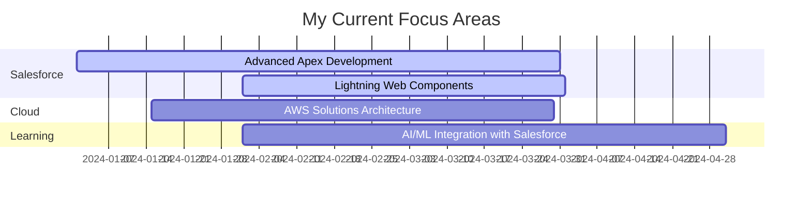

<div align="center">
  
# 👨‍💻 Jyothiswaroop Boggavarapu

### 8x Salesforce Certified Developer | Senior Salesforce Omnistudio Developer

[](https://linkedin.com/in/Jyothiswaroop25)
[](https://www.salesforce.com/trailblazer/jyothiswaroop25)
[](https://www.jyothiswaroopboggavarapu.com/)
[](mailto:bjyothiswaroop7@gmail.com)


</div>

---

## 🚀 About Me
```typescript
const jyothiswaroop = {
    role: "Senior Salesforce Omnistudio Developer",
    experience: "7+ Years",
    location: "United States 🇺🇸",
    education: {
        masters_current: "Masters in Data Science @ Indiana Wesleyan University",
        masters_previous: "Masters in Computer Science @ University of North Texas",
        bachelors: "Computer Science and Engineering @ SCSVMV University"
    },
    certifications: "8x Salesforce Certified",
    currentFocus: ["Salesforce Omnistudio Development", "Data Loads", "System Integration"],
    funFact: "I turn coffee into code ☕️ → 💻"
};
```

### 💼 Professional Highlights

<table>
<tr>
<td width="50%">

#### 🏆 Experience
- **7+ Years** in IT Industry
- **4 Years** Salesforce Specialist
- **3 Years** Software Engineer
- **8x** Salesforce Certified

</td>
<td width="50%">

#### 🎯 Expertise
- Force.com & Apex Development
- Lightning Web Components (LWC)
- OmniStudio Components
- REST/SOAP API Integration

</td>
</tr>
</table>

<!--### 🌟 Key Achievements

<div align="center">

| 🏅 Award | 🏛️ Organization |
|---------|----------------|
| **Toulouse Graduate School Academic Achievement Scholar** | University of North Texas |
| **"Path on the Track" Award** | Mobius Knowledge Service |

</div> -->

---
## 🏆 Salesforce Certifications

<div align="center">

### 8x Certified Salesforce Professional

<table>
<tr>
<td align="center" width="25%">

</a>
<br/>
<sub><b>Administrator</b></sub>
</td>
<td align="center" width="25%">

</a>
<br/>
<sub><b>Platform Developer I</b></sub>
</td>
<td align="center" width="25%">

</a>
<br/>
<sub><b>Sales Cloud Consultant</b></sub>
</td>
<td align="center" width="25%">

</a>
<br/>
<sub><b>Service Cloud Consultant</b></sub>
</td>
</tr>
<tr>
<td align="center" width="25%">

</a>
<br/>
<sub><b>OmniStudio Consultant</b></sub>
</td>
<td align="center" width="25%">

</a>
<br/>
<sub><b>OmniStudio Developer</b></sub>
</td>
<td align="center" width="25%">

</a>
<br/>
<sub><b>AI Associate</b></sub>
</td>
<td align="center" width="25%">

</a>
<br/>
<sub><b>Associates Specialist</b></sub>
</td>
</tr>
</table>

</div>
---

## 🛠️ Tech Arsenal

### ☁️ Cloud & Platforms


### 💻 Salesforce Stack


### 🔧 Languages & Frameworks


### 📚 Frameworks & Libraries


### 🤖 AI/ML & Data Science


### 🗄️ Databases


### 🔨 DevOps & Tools


### 🎨 Design Tools


### 🖥️ Servers


---

## 📊 GitHub Analytics

<div align="center">


<!--


-->
</div>

---

<!-- ## 🎯 What I'm Up To


---
-->
<!--## 💡 Core Competencies

<div align="center">
```diff
+ Salesforce Development (Apex, LWC, Visualforce)
+ Cloud Architecture (AWS, GCP, Heroku)
+ Full Stack Development (Python, Django, PHP)
+ API Integration (REST, SOAP)
+ Database Management (MySQL, MongoDB, SQL Server)
+ DevOps & CI/CD (Git, GitHub Actions)
+ Agile/Scrum Methodologies
+ Team Leadership & Mentoring
```

</div> 

---
-->

## 📫 Let's Connect!

<div>

### 🤝 I'm always open to:
- 💼 Collaborating on innovative Salesforce projects
- 🌟 Contributing to open-source initiatives
- 💡 Discussing cloud architecture and best practices
- 🎯 Exploring new opportunities in tech

### 📬 Reach me at:

[](https://linkedin.com/in/Jyothiswaroop25)
[](https://www.salesforce.com/trailblazer/jyothiswaroop25)
[](mailto:bjyothiswaroop7@gmail.com)

</div>

---

<div>

### ⚡ Fun Fact
*"I believe in writing clean code that solves real-world problems and creates lasting impact."*

### 🎮 When I'm Not Coding


---


**💙 Thanks for visiting! Let's build something amazing together!**

</div>

<!-- Proudly crafted with passion 🚀 -->
